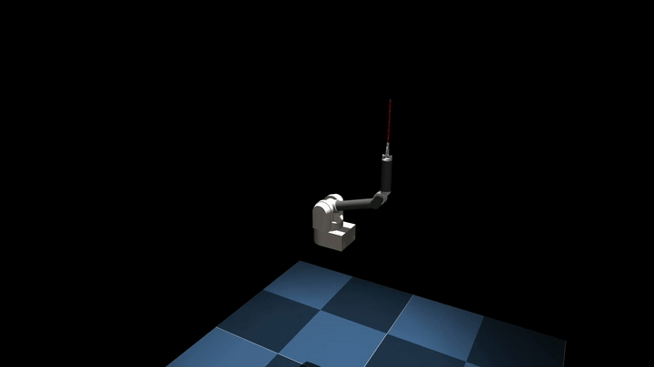

# [IP2] Pendulum Acrobatics

Integrated Project SoSe 2023 by Florian Wolf, supervised by Pascal Klink and Kai Ploeger.

## Abstract

For decades, cart-pole systems have been an important benchmark problem for dynamics and control theory. Due to their high level of nonlinearity, instability and underactuation, they require fast-reactive controllers and are widely used to test emerging control approaches. However, the possible motion profiles of the classical cart-pole system are limited by the rectilinear cart motion. Furthermore, the system is typically investigated in isolation, directly allowing the cart to be displaced. In this work, we investigate a three-dimensional spherical cart-pole system that is realized at the end effector of a Barrett WAM robotic arm, allowing for more challenging motions to be generated while simultaneously introducing a kinematic subtask in the control problem. As we probe the dynamics of this extended system, our experiments show that the simpler gain tuning of the classical LQR controller is preferable over the more intricate MPC approach. The absence of time delays eliminates the need for complex state estimation techniques to compensate for time losses due to parallel execution. Moreover, the LQR controller's ability to promptly respond to state disturbances proves advantageous and allows to convincingly perform stabilization and trajectory tracking tasks. The system operates comfortably at a control frequency of 120 Hz providing a high temporal resolution for control actions.

## Simulation

## Real System
